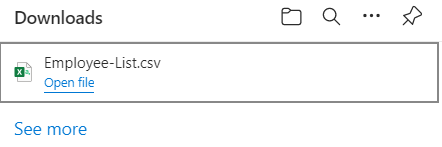

# Export OpenCsv

Export and download the data as a CSV file in a Spring Boot project.

## Technologies used

### Java 17

### Spring Boot 2.7.3

### OpenCSV 5.6

### Spring Data JPA

### H2DB

### Maven

## Demo

Hit this URL in your local system 
<strong>http://localhost:8080/export</strong> 
Result: 

